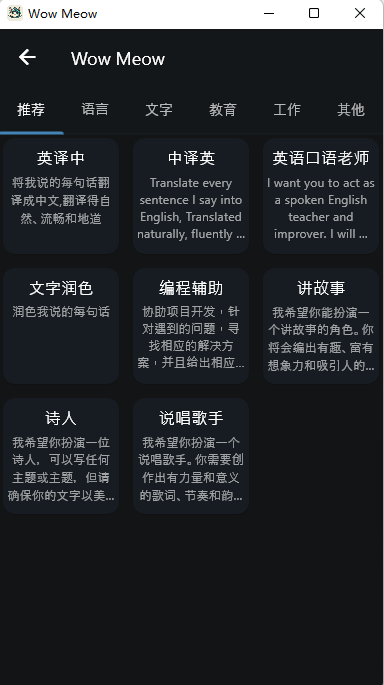
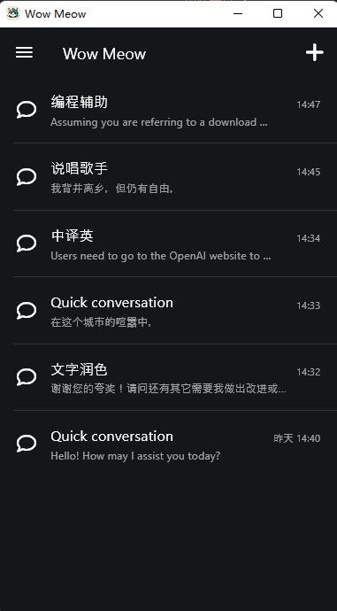

# Wow Meow

This project is currently only used as a release page and the code has not been open sourced yet. Currently, only **Android** and **Windows** versions are available and you can download them by clicking on "[Release](https://github.com/ElvisZP/wow_meow_release/releases)".

Users need to go to the OpenAI website to obtain their own API key, your API key is stored on your device internally and will never be sent to any other location.

This project was developed to meet my own needs, so updates may be slow.

If you have any questions, you can submit an issue.

### Next todo

* [ ] A complete template library
* [ ] Commonly used tool library (image generation, file translation ...)
* [ ] Support for Azure TTS
* [x] Support for Google TTS
* [ ] The desktop version supports TTS
* [x] Custom domain

### Screenshot

